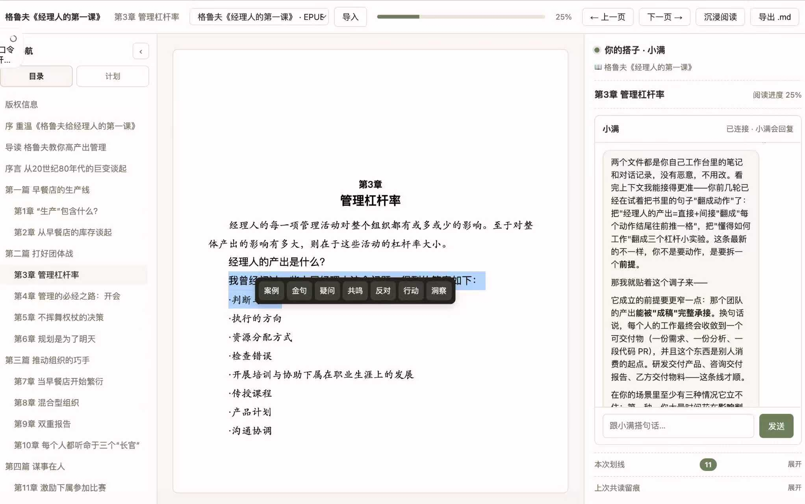

# reading-companion

让你的 Agent 坐到书桌旁边。

读到一句话有点扎心，划下来；觉得作者哪里不对，直接反驳；突然想到自己的例子，就顺手讲给它听。`reading-companion` 会把这些读书现场接住：一边陪你聊，一边把划线、疑问、反对、行动和洞察沉淀成卡片与阅读画像。书和对话都留在你电脑上。下次继续读，它不是从零开始，而是记得你怎么读、哪里容易卡住、喜欢把知识变成什么样的东西。

## 快速开始

把这段话发给你的 agent：

```text
请安装并使用这个 reading-companion skill：
https://github.com/Tanangyuanan/reading-companion

把它加载为名叫 reading-companion 的 skill，在 skill 包外创建 reading workspace，
询问我要读的书名或本地文件路径，运行 python3 <reading-workspace>/启动共读.py，
然后把本地共读页面链接给我。后续共读时，请使用 workspace 里的 profile 文件记住我的阅读习惯。
```

如果你的 agent 不能自动安装 skill，就先 clone 这个仓库，把 `reading-companion` 文件夹放到你的 agent runtime 会加载 skills 的目录里，然后再发送上面这段话。

## 项目介绍

`reading-companion` 是一个开源的 agent skill，用来把你的 agent 变成本地共读搭子。它不是把书上传到某个云端阅读产品，而是给 agent 一套可复用的工作流：准备 reading workspace、启动浏览器阅读器、在本机可用时接入模型 CLI、记录划线和对话，并长期维护一份轻量的阅读画像。

这个项目由三层组成：

- **Skill 指令层**：`SKILL.md` 和 `references/` 告诉 agent 怎么启动共读、什么时候询问书名或文件路径、如何使用阅读记忆，以及如何避免把用户私有状态写进 skill 包。
- **本地阅读运行时**：`assets/coread/`、`assets/frontend/` 和 `scripts/init_reading_workspace.py` 负责创建本地阅读器、实时桥、dashboard、日志、卡片和 profile 文件。
- **用户自己的 workspace**：真实书籍、划线、对话记录、卡片草稿和阅读画像信号，都保存在用户机器上的独立 reading workspace 里。

所以它的目标不是做一次性的 AI 总结，而是做一个会随着共读互动变得更懂你的本地阅读搭子。它会从划线、提问、纠正、卡片选择里积累信号，下次继续读时，把这些本地 profile 当作上下文使用。



这个界面围绕“正在读书的现场”组织：左侧是目录和阅读计划，中间是书页，右侧是共读对话。你划中一句话，可以把它标成案例、金句、疑问、共鸣、反对、行动或洞察；这些互动会继续沉淀成卡片和个性化阅读记忆。

它不只是一次性的阅读页面，也包含一套本地个性化记忆。每个 reading workspace 都会保存有证据的阅读偏好、反复出现的问题、你更喜欢的卡片方式，以及你对 agent 判断的纠正。下一次读书时，agent 可以把这些画像作为默认上下文，更懂你的阅读习惯；但你当下说的阅读目标永远优先于旧记录。

## 能做什么

- 创建本地 reading workspace，并通过 Python 启动共读桥
- 启动器运行后，在本机浏览器里打开共读页面
- 支持本地 EPUB/PDF/HTML/Markdown/文本，也支持没有原文的摘录式共读
- 记录划线、碎念、对话、卡片候选
- 从真实互动里形成本地阅读画像，而不是只做通用摘要
- 把用户数据写到独立 reading workspace，不写进 skill 包
- 自动探测本机 `PATH` 上的 `claude` / `codex` / `gemini`
- 没有模型 CLI 时，也能作为阅读器和划线工具使用

## 个性化阅读记忆

记忆系统存在于你创建的 reading workspace 里，不存在于这个仓库，也不依赖云端账号。

- `profile.md` 保存已确认、可在下次会话默认使用的阅读偏好
- `profile-signals.jsonl` 保存划线、反应、卡片选择、纠正等互动证据
- `profile-candidates.md` 保存还不够确定的候选观察，避免过早写入画像

这套记忆的边界很窄：它只应该帮助 agent 理解你的阅读习惯、解释偏好、卡片风格和反复卡住的地方。它不应该推断你的私人身份、生活背景或敏感特征，除非你明确提供。当前会话里的要求永远高于旧画像。

## 手动安装为 Skill

先把这个文件夹作为 agent skill 安装到你的 agent CLI 会加载 skills 的位置。文件夹名保留为 `reading-companion`，如果你的运行时需要，安装后重启或重新加载 agent。

然后直接对 agent 说你要开始共读，例如：

```text
用 reading-companion 陪我读《经理人的第一课》。
```

或者：

```text
为这个本地 EPUB 开一个共读 workspace，帮我把划线变成卡片。
```

agent 应该根据这个 skill 完成这些事：

- 在 skill 包外选择或创建 reading workspace
- 找到书籍文件，或者在没有原文时进入摘录式共读
- 运行 workspace 里的启动器：`python3 <reading-workspace>/启动共读.py`
- 启动成功后，把本地共读页面 URL 给你
- 下次继续读时，先读取 `profile.md`、`profile-signals.jsonl` 和最近会话状态

## 手动试跑

如果你只是想先验证这个包能跑，不想先装进 agent，可以创建一个临时共读工作区：

```bash
python3 scripts/init_reading_workspace.py /tmp/reading-companion-demo --book "Demo Book" --source-mode user-input-driven
```

启动本地 Python 服务：

```bash
python3 /tmp/reading-companion-demo/启动共读.py
```

然后打开启动器提供的本地页面：

```text
http://127.0.0.1:8768/共读.html
```

这个 URL 只有在 `启动共读.py` 正在运行时才可用。启动器会启动本地 HTTP 页面和实时桥，并把最终端口写到 workspace 里的 `启动信息.md`。

如果本机能找到 `claude`、`codex` 或 `gemini`，启动器会自动接入模型回复；如果找不到，页面仍然可以阅读、划线和保存日志。

指定模型 CLI：

```bash
COREAD_MODEL_ENABLED=1 COREAD_MODEL_CLI=codex python3 /tmp/reading-companion-demo/启动共读.py
```

关闭模型回复，只用阅读器：

```bash
COREAD_MODEL_ENABLED=0 python3 /tmp/reading-companion-demo/启动共读.py
```

## 数据边界

这个仓库不应该包含真实用户数据。真实书籍、profile、共读日志、对话记录都应该在你创建的 reading workspace 里。

发布前请检查：

```bash
find . -type d \( -name tmp -o -name .harness -o -name .venv -o -name venv -o -name __pycache__ \) -print
rg -n "<个人姓名>|<私人助手名>|<本机绝对路径>|<凭证变量>|<密钥前缀>" . --glob '!references/cli-compatibility.md'
```

## 文档

- [快速上手](docs/GETTING_STARTED.md)
- [配置说明](docs/CONFIGURATION.md)
- [隐私和数据边界](docs/PRIVACY.md)
- [开发说明](docs/DEVELOPMENT.md)
- [发布检查清单](RELEASE_CHECKLIST.md)

## 当前状态

这是早期开源包。核心流程已经可以本地启动，但还需要更多不同系统、不同 agent CLI 的真实试用反馈。

## License

当前还没有选择公开 license。正式公开 GitHub 仓库前，需要先补 license。
